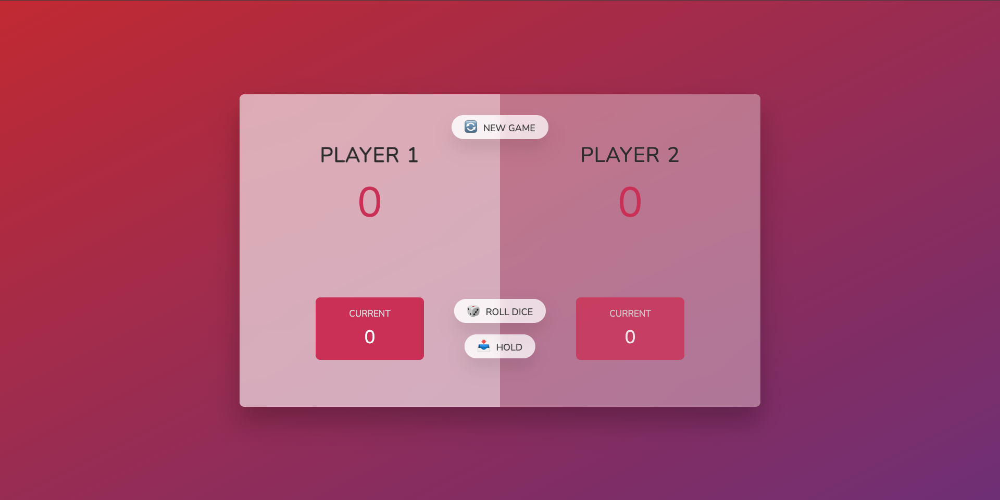

# Pig Game 🎲🐖



## Overview

The **Pig Game** is a simple two-player dice game where players take turns rolling a dice. The goal of the game is to reach a target score (e.g., 100 points) before the other player. On each turn, a player rolls the dice repeatedly, accumulating points until they either choose to hold and secure their points, or roll a 1, which causes them to lose all points for that turn.

This project is based on **Jonas Schmedtmann's course** on **"The Complete JavaScript Course"**. It was developed as part of the learning process in the course, and serves as a practical application of JavaScript concepts.

## Structure


## Rules

1. **Two Players**: The game is played between two players who take turns.
2. **Rolling the Dice**: On each player's turn, they can roll the dice as many times as they want, adding the roll result to their temporary score.
3. **Rolling a 1**: If the player rolls a 1, their turn ends, and their temporary score for that turn is lost.
4. **Holding**: At any point during their turn, a player can choose to hold, which adds their temporary score to their total score, and ends their turn.
5. **Winning the Game**: The first player to reach the winning score (e.g., 100 points) wins the game.

## Features

- **Two-Player Mode**: Play against a friend.
- **Dice Rolling Animation**: Visual representation of dice rolls.
- **Hold Feature**: Secure your points before risking losing them.
- **Reset Game**: Option to restart the game at any time.
  
## Tech Stack

- **Frontend**: HTML, CSS, JavaScript

## Installation

1. Clone the repository:
   ```bash
   git clone github.com/WMFK98/Pig-Game
   ```
3. Into the project:
   ```bash
   cd Pig-Game
   ```
4. Install the library:
   ```bash
   npm install
   ```
5. Run the project:
   ```bash
   npx live-server
   ```
   
